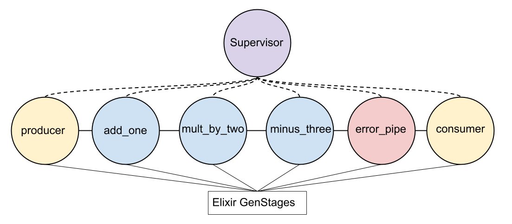
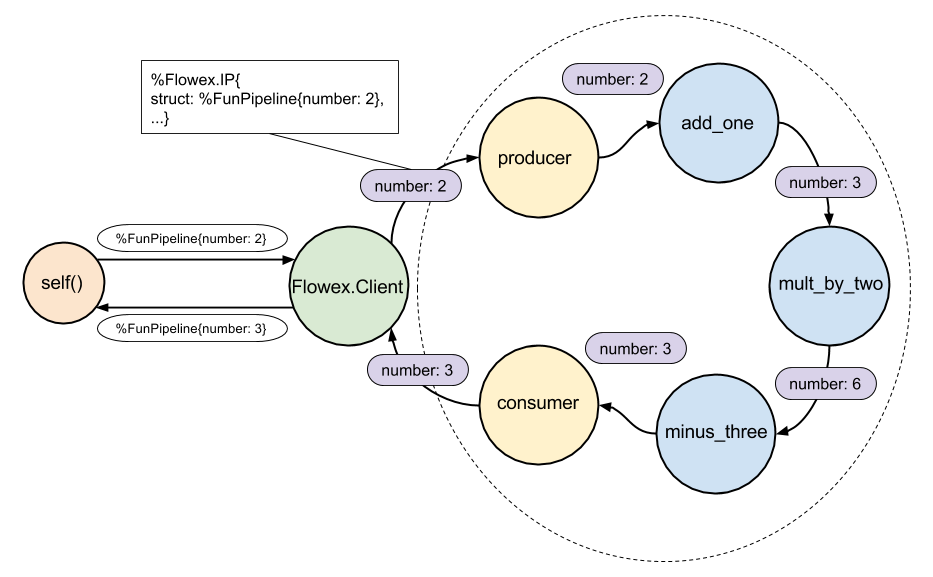
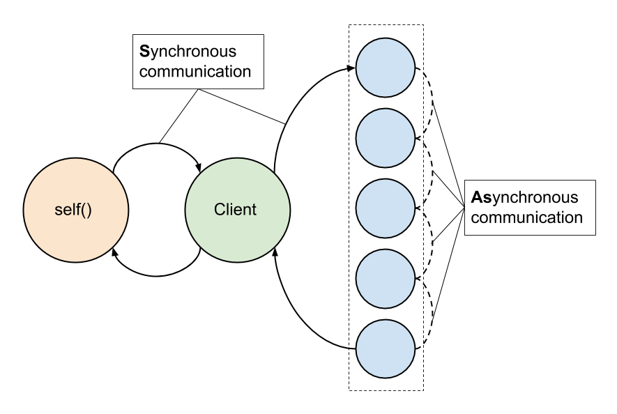
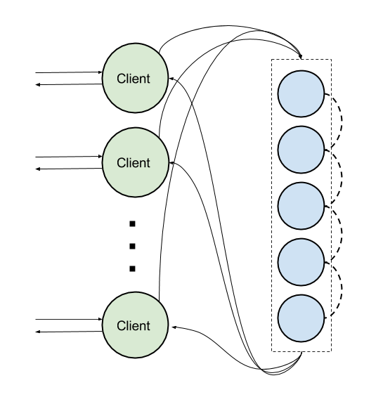
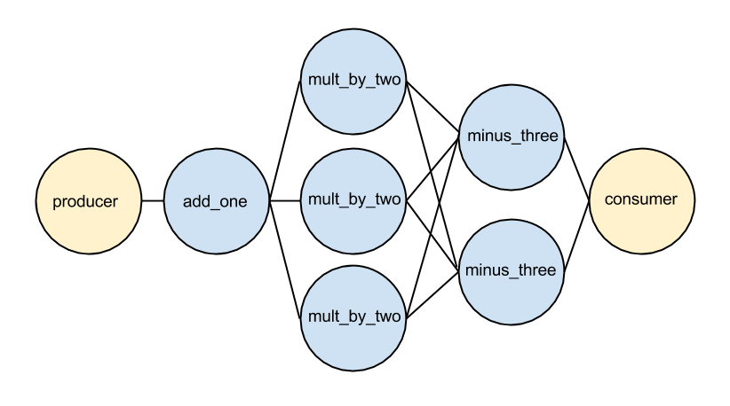

# Flowex
[](https://travis-ci.org/antonmi/flowex)
[](https://hex.pm/packages/flowex)

## Railway Flow-Based Programming.
#### Flowex is a set of abstractions built on top Elixir GenStage which allows writing program with [Flow-Based Programming](https://en.wikipedia.org/wiki/Flow-based_programming) paradigm.
I would say it is a mix of FBP and so-called [Railway Oriented Programming (ROP)](http://fsharpforfunandprofit.com/rop/) approach.

Flowex DSL allows you to easily create "pipelines" of Elixir GenStages.
#### Dedicated to my lovely girlfriend Chryścina.

## Resources
- [Railway Flow-Based Programming with Flowex](https://medium.com/@anton.mishchuk/railway-flow-based-programming-with-flowex-ef04fd338e41#.wiy3c5g9i) - post
- [Flowex: Flow-Based Programming with Elixir GenStage](https://www.slideshare.net/Elixir-Meetup/flowex-flowbased-programming-with-elixir-genstage-anton-mishchuk) - presentation
- [Flow-based programming with Elixir](https://www.slideshare.net/AntonMishchuk/flowbased-programming-with-elixir) - presentation
- [Flow-Based REST API with Flowex and Plug](https://medium.com/@anton.mishchuk/flow-based-rest-api-with-flowex-and-plug-323d6920f166) - post
- [Multi language FBP with Flowex](https://www.slideshare.net/pivorak/multi-language-fbp-with-flowex-by-anton-mishchuk?qid=acfe02be-c264-4886-90b5-3cba4edf77ef&v=&b=&from_search=16) - presentation
- [Multi-language Flowex components](https://medium.com/@anton.mishchuk/multi-language-flowex-components-fdda11d34744) - post
- [Flow-Based REST API with Flowex and Plug](https://medium.com/@anton.mishchuk/flow-based-rest-api-with-flowex-and-plug-323d6920f166) - post

## Contents
- [Installation](#installation)
- [A simple example to get the idea](#a-simple-example-to-get-the-idea)
- [More complex example for understanding interface](#more-complex-example-for-understanding-interface)
- [Flowex magic!](#flowex-magic!)
- [Run the pipeline](#run-the-pipeline)
- [How it works](#how-it-works)
- [Error handling](#error-handling)
- [Pipeline and pipe options](#pipeline-and-pipe-options)
- [Synchronous and asynchronous calls](#synchronous-and-asynchronous-calls)
- [Bottlenecks](#bottlenecks)
- [Module pipes](#module-pipes)
- [Data available in pipes](#data-available-in-pipes)
- [Starting strategies](#starting-strategies)
- [Debugging with Flowex.Sync.Pipeline](#debugging-with-flowex.sync.pipeline)
- [Contributing](#contributing)

## Installation
Just add `flowex` as dependency to the `mix.exs` file.

## A simple example to get the idea
Let's consider a simple program which receives a number as an input, then adds one, then multiplies the result by two and finally subtracts 3.

```elixir
defmodule Functions do
  def add_one(number), do: number + 1
  def mult_by_two(number), do: number * 2
  def minus_three(number), do: number - 3
end

defmodule MainModule do
  def run(number) do
    number
    |> Functions.add_one
    |> Functions.mult_by_two
    |> Functions.minus_three
  end
end
```
So the program is a pipeline of functions with the same interface. The functions are very simple in the example.

In the real world they can be something like `validate_http_request`, `get_user_from_db`, `update_db_from_request` and `render_response`.
Furthermore, each of the function can potentially fail. But for getting the idea let's stick the simplest example.

FBP defines applications as networks of "black box" processes, which exchange data across predefined connections by message passing.

To satisfy the FBP approach we need to place each of the function into a separate process. So the number will be passed from 'add_one' process to 'mult_by_two' and then 'minus_three' process which returns the final result.

That, in short, is the idea of Flowex!

## More complex example for understanding interface
Let's define a more strict interface for our function.
So each of the function will receive a predefined struct as a first argument and will return a map:

```elixir
def add_one(%{number: number}, opts) do
  %{number: number + 1, a: opts.a}
end
```
The function receives a structure with `number` field and the options map with field `a`  and returns map with new number.
The second argument is a set of options and will be described later.
Let's rewrite the whole `Functions` module in the following way:
```elixir
defmodule Functions do
  defstruct number: nil, a: nil, b: nil, c: nil

  def add_one(%{number: number}, %{a: a}) do
    %{number: number + 1, a: a}
  end

  def mult_by_two(%{number: number}, %{b: b}) do
    %{number: number * 2, b: b}
  end

  def minus_three(%{number: number}, %{c: c}) do
    %{number: number - 3, c: c}
  end
end
```
The module defines three functions with the similar interface.
We also defined as struct `%Functions{}` which defines a data-structure being passed to the functions.

The main module may look like:
```elixir
defmodule MainModule do
  def run(number) do
    opts = %{a: 1, b: 2, c: 3}
    %Functions{number: number}
    |> Functions.add_one(opts)
    |> Functions.mult_by_two(opts)
    |> Functions.minus_three(opts)
  end
end
```

## Flowex magic!
Let's add a few lines at the beginning.
```elixir
defmodule FunPipeline do
  use Flowex.Pipeline

  pipe :add_one
  pipe :mult_by_two
  pipe :minus_three

  defstruct number: nil, a: nil, b: nil, c: nil

  def add_one(%{number: number}, %{a: a}) do
    %{number: number + 1, a: a}
  end

  # mult_by_two and minus_three definitions skipped
end
```
We also renamed the module to `FunPipeline` because we are going to create "Flowex pipeline".
`Flowex.Pipeline` extend our module, so we have:
- `pipe` macro to define which function evaluation should be placed into separate GenStage;
- `error_pipe` macro to define function which will be called if error occurs;
- `start`, `supervised_start` and `stop` functions to create and destroy pipelines;
- `call` function to run pipeline computations synchronously.
- `cast` function to run pipeline computations asynchronously.
- overridable `init` function which, by default, accepts `opts` and return them

Let's start a pipeline:
```elixir
opts = %{a: 1, b: 2, c: 3}

pipeline = FunPipeline.start(opts)

#returns
%Flowex.Pipeline{in_name: :"Flowex.Producer_#Reference<0.0.7.504>",
 module: FunPipeline, out_name: :"Flowex.Consumer_#Reference<0.0.7.521>",
 sup_pid: #PID<0.136.0>}
```
What happened:
- Three GenStages have been started - one for each of the function in pipeline. Each of GenStages is `:producer_consumer`;
- One additional GenStage for error processing has been started (it is also `:producer_consumer`);
- 'producer' and 'consumer' GenStages for input and output have been added;
- All the components have been placed under Supervisor.

The next picture shows what the 'pipeline' is.


The `start` function returns a `%Flowex.Pipeline{}` struct with the following fields:
- module - the name of the module
- in_name - unique name of 'producer';
- out_name - unique name of 'consumer';
- sup_name - unique name of the pipeline supervisor

Note, we have passed options to `start` function. This options will be passed to each function of the pipeline as a second argument.
There is `supervised_start` function which allows to place pipeline's under external supervisor.
See details in [Starting strategies](#starting-strategies) section.

## Run the pipeline
One can run calculations in pipeline synchronously and asynchronously:
- `call` function to run pipeline computations synchronously.
- `cast` function to run pipeline computations asynchronously.

`FunPipeline.call/2` function receive a `%Flowex.Pipeline{}` struct as a first argument and must receive a `%FunPipeline{}` struct as a second one.
The `call` function returns a %FunPipeline{} struct.

```elixir
FunPipeline.call(pipeline, %FunPipeline{number: 2})
# returns
%FunPipeline{a: 1, b: 2, c: 3, number: 3}
```
As expected, pipeline returned `%FunPipeline{}` struct with `number: 3`. `a`, `b` and `c` were set from options.

If you don't care about the result, you should use `cast/2` function to run and forget.
```elixir
FunPipeline.cast(pipeline, %FunPipeline{number: 2})
# returns
:ok
```

## Run via client
Another way is using `Flowex.Client` module which implements GenServer behavior.
The `Flowex.Client.start\1` function receives pipeline struct as an argument.
Then you can use `call/2` function or `cast/2`. See example below:
```elixir
{:ok, client_pid} = Flowex.Client.start(pipeline)

Flowex.Client.call(client_pid, %FunPipeline{number: 2})
# returns
%FunPipeline{a: 1, b: 2, c: 3, number: 3}

#or
Flowex.Client.cast(client_pid, %FunPipeline{number: 2})
# returns
:ok
```
## How it works
The following figure demonstrates the way data follows:

Note: `error_pipe` is not on the picture in order to save place.

The things happen when you call `Flowex.Client.call` (synchronous):
- `self` process makes synchronous call to the client gen_server with `%FunPipeline{number: 2}` struct;
- the client makes synchronous call 'FunPipeline.call(pipeline, %FunPipeline{number: 2})';
- the struct is wrapped into `%Flowex.IP{}` struct and begins its asynchronous journey from one GenStage to another;
- when the consumer receives the Information Packet (IP), it sends it back to the client which sends it back to the caller process.

The things happen when you `cast` pipeline (asynchronous):
- `self` process makes `cast` call to the client and immediately receives `:ok`
- the client makes `cast` to pipeline;
- the struct is wrapped into `%Flowex.IP{}` struct and begins its asynchronous journey from one GenStage to another;
- consumer does not send data back, because this is `cast`

## Error handling
What happens when error occurs in some pipe?

The pipeline behavior is like Either monad. If everything ok, each 'pipe' function will be called one by one and result data will skip the 'error_pipe'.
But if error happens, for example, in the first pipe, the `:mult_by_two` and `:minus_three` functions will not be called.
IP will bypass to the 'error_pipe'. If you don't specify 'error_pipe' flowex will add the default one:
```elixir
def handle_error(error, _struct, _opts) do
  raise error
end
```
which just raises an exception.

To specify the 'error' function use `error_pipe` macro:
```elixir
defmodule FunPipeline do
  use Flowex.Pipeline
  # ...
  error_pipe :if_error


  def if_error(error, struct, opts) do
    # error is %Flowex.PipeError{} structure
    # with :message, :pipe, and :struct fields
    %{number: :oops}
  end
  #...
end
```
You can specify only one error_pipe!
Note: The 'error_pipe' function accepts three arguments.
The first argument is a `%Flowex.PipeError{}` structure which has the following fields:
- `:message` - error message;
- `:pipe` - is `{module, function, opts}` tuple containing info about the pipe where error occured;
- `:struct` - the input of the pipe.

## Pipeline and pipe options
In addition to specifying options when starting pipeline one can pass component's options to the `pipe` macro.
And remember about pipeline's `init` function which can add or override options.
The flow is the following:
The options passed to `start` function are available in pipeline `init` function. The function can merge additional options. Then `opts` passed to `pipe` macro are merged.
So there are three levels that options pass before appearing in component:
- pipeline `start` function;
- pipeline `init` function;
- pipe `opts`.

Let's consider an example:
```elixir
defmodule InitOptsFunPipeline do
  use Flowex.Pipeline

  defstruct [:from_start, :from_init, :from_opts]
  pipe :component, opts: %{from_opts: 3}

  def init(opts) do
    # opts passed to start function is available here
    Map.put(opts, :from_init, 2)
   end

  def component(_data, opts) do
    # here all the options is available
    opts
  end
end
```
Suppose we've started the pipeline with options `%{from_start: 1}`. 
`init` function adds `:from_init` option. Then `:from_opts` are merged.

The test below illustrates what is going on:
```elixir
describe "function pipeline" do
  let :pipeline, do: InitOptsFunPipeline.start(%{from_start: 1})
  let :result, do: InitOptsFunPipeline.call(pipeline(), %InitOptsFunPipeline{})

  it "returns values from different init functions" do
    expect(result())
    |> to(eq %InitOptsFunPipeline{from_start: 1, from_init: 2, from_opts: 3})
  end
end
```

## Synchronous and asynchronous calls
Note, that `call` function on pipeline module or `Flowex.Client` is synchronous. While communication inside the pipeline is asynchronous:

One might think that there is no way to effectively use the pipeline via `call/2` method.

That's not true!

In order to send a large number of IP's and process them in parallel one can use several clients connected to the pipeline:


## Bottlenecks
Each component of pipeline takes a some to finish IP processing. One component does simple work, another can process data for a long time.
So if several clients continuously push data they will stack before the slowest component. And data processing speed will be limited by that component.

Flowex has a solution! One can define a number of execution processes for each component.
```elixir
defmodule FunPipeline do
  use Flowex.Pipeline

  pipe :add_one, count: 1
  pipe :mult_by_two, count: 3
  pipe :minus_three, count: 2
  error_pipe :if_error, count: 2

  # ...
end
```
And the pipeline will look like on the figure below:



## Module pipes
One can create reusable 'pipe' - module which implements init and call functions.
Each module must define a struct it works with. Only fields defined it the stuct will be passed to `call` function.
```elixir
defmodule ModulePipeline do
  use Flowex.Pipeline

  defstruct [:number, :a, :b, :c]

  pipe AddOne, count: 1
  pipe MultByTwo, count: 3
  pipe MinusThree, count: 2
  error_pipe IfError, count: 2
end

#pipes

defmodule AddOne do
  defstruct [:number]

  def init(opts) do
    %{opts | a: :add_one}
  end

  def call(%{number: number}, %{a: a}) do
    %{number: number + 1, a: a}
  end
end

defmodule MultByTwo do
  defstruct [:number]

  def init(opts) do
    %{opts | b: :mult_by_two}
  end

  def call(%{number: number}, %{b: b}) do
    %{number: number * 2, b: b}
  end
end

defmodule MinusThree do
  defstruct [:number]

  def init(opts) do
    %{opts | c: :minus_three}
  end

  def call(%{number: number}, %{c: c}) do
    %{number: number - 3, c: c}
  end
end

defmodule IfError do
  defstruct [:number]

  def init(opts), do: opts

  def call(error, %{number: _number}, _opts) do
    %{number: error}
  end
end
```

Of course, one can combine module and functional 'pipes'!

## Data available in pipes
If your pipeline consists of function pipes only, each function will receive pipeline struct as an input.
The situation is a little more complex with module pipes.
Each module defines its own struct and data will be cast to that struct.
Map returned from the `call function` will be merged to the previos data.
Let's consider an example:
```elixir
defmodule DataAvailable do
  use Flowex.Pipeline

  defstruct [:top, :c1, :foo]

  pipe Component1
  pipe :component2
  pipe Component3

  def component2(%__MODULE__{top: top}, _opts) do
    %{top: top + 2, c3: 2}
  end
end

defmodule Component1 do
  defstruct [:top, :c1]
  def init(opts), do: opts

  def call(%__MODULE__{c1: c1, top: top}, _opts) do
    %{top: top + c1, bar: :baz}
  end
end

defmodule Component3 do
  defstruct [:c3, :top]
  def init(opts), do: opts

  def call(%__MODULE__{c3: c3, top: top}, _opts) do
    %{top: top + c3, c3: top - c3, foo: :set_foo}
  end
end
```
And suppose we passed `%DataAvailable{top: 100, c1: 1}` to `DataAvailable.call` function.

Data in IP before calling first pipe is `%{c1: 1, foo: nil, top: 100}`.
Before entering the first pipe the data will be cast to `%Component1{c1: 1, top: 100}`.
The returned value of first pipe is merged to IP data, so the data is `%{bar: :baz, c1: 1, foo: nil, top: 101}`.

Function `component2` receives `%DataAvailable{c1: 1, foo: nil, top: 101}` structure and returned value `%{c3: 2, top: 103}` is merged with previous data,
so IP data is `%{bar: :baz, c1: 1, c3: 2, foo: nil, top: 103}`

Last component receives `%Component3{c3: 2, top: 103}`, returns `%{c3: 101, foo: :set_foo, top: 105}` and data is `%{bar: :baz, c1: 1, c3: 101, foo: :set_foo, top: 105}`.
Before returning data from pipeline they are casted to `DataAvailable` structure, so final result is `%DataAvailable{c1: 1, foo: :set_foo, top: 105}}`

## Starting strategies
Using `start/1` function one can start pipelines in any process. Pipelines will be alive while the process is alive.
The `supervised_start` function accepts supervisor `pid` as the first argument and `opts` as the second argument.
And starts pipeline's supervisor under predefined supervisor process.

In general there are three ways to start pipelines in your project:

1. Start pipelines in arbitrary supervised process:
```elixir
defmodule PipelineGenServer do
  use GenServer

  def init(_opts) do
    pipeline_one = PipelineOne.start
    pipeline_two = PipelineTwo.start

    {:ok, %{pipeline_one: pipeline_one, pipeline_two: pipeline_two}}
  end
end
```
You can also store pipeline structure in Agent or Application environment.

2. Start one pipeline per application. In that case pipeline supervisor will be the main supervisor in the application:
```elixir
defmodule OnePipelinePerApp do
  use Application

  def start(_type, _opts) do
    pipeline = PipelineOne.start
    Application.put_env(:start_flowex, :pipeline, pipeline)
    {:ok, pipeline.sup_pid}
  end
end
```

3. Start several pipelines inside one application using `supervised_start` function. In that case pipeline supervisors will be placed under application supervisor:
```elixir
defmodule TwoPipelinesPerApp do
  use Application

  def start(_type, _opts) do
    {:ok, supervisor_pid} = Supervisor.start_link([], strategy: :one_for_one, name: :multi_flowex_sup)

    pipeline_one = PipelineOne.supervised_start(supervisor_pid)
    pipeline_two = PipelineTwo.supervised_start(supervisor_pid)

    Application.put_env(:start_flowex, :pipeline_one, pipeline_one)
    Application.put_env(:start_flowex, :pipeline_two, pipeline_two)

    {:ok,supervisor_pid}
  end
end
```

You can find the examples in ['Start-Flowex'](https://github.com/antonmi/Start-Flowex) project

## Debugging with Flowex.Sync.Pipeline
If you are faced with some error that is hard to debug or error that causes GenServers to crush, you may find useful `Flowex.Sync.Pipeline` module.
Adding one `Sync` word will completely change the behavior.
```elixir
defmodule FunPipeline do
  use Flowex.Sync.Pipeline
  # The same code as before
  # ...
end  
```
Interface remains the same but all the code will be evaluated in one simple GenServer. 
So all you pipes will be evaluated synchronously in separate process.
Use this option only for debug purposes.

## Contributing
#### Contributions are welcome and appreciated!

Request a new feature by creating an issue.

Create a pull request with new features or fixes.

Flowex is tested using ESpec. So run:
```sh
mix espec
```
